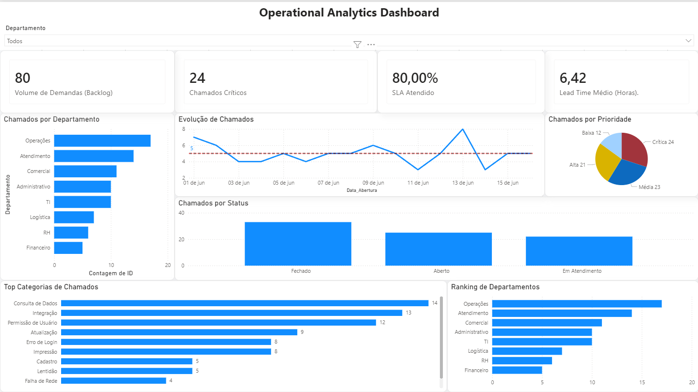

# Process SLA Analytics Dashboard

Dashboard analítico desenvolvido em Power BI para monitoramento operacional de chamados, SLA e indicadores de desempenho.



---

# Objetivos do Projeto

- Monitorar volume de demandas operacionais
- Acompanhar indicadores de SLA
- Identificar gargalos de atendimento
- Apoiar tomada de decisão baseada em dados

---

# Indicadores Monitorados

- Lead Time Médio
- Volume de Demandas
- Chamados Críticos
- Evolução Temporal
- Ranking de Departamentos
- Top Categorias de Chamados

---

# Tecnologias Utilizadas

- Power BI
- DAX
- Power Query
- Excel / CSV
- Data Analytics

---

# Conceitos Aplicados

- Business Intelligence
- Data Visualization
- KPI Management
- Process Analytics
- Six Sigma
- SLA Monitoring

---

# Estrutura do Projeto

```text
process-sla-analytics-dashboard/
│
├── Operational Analytics Dashboard.pbix
├── chamados.csv
├── dashboard.png
└── README.md
```

---

# Autor

Emerson Vieira  
Analista de Sistemas | BI | Dados | Processos
